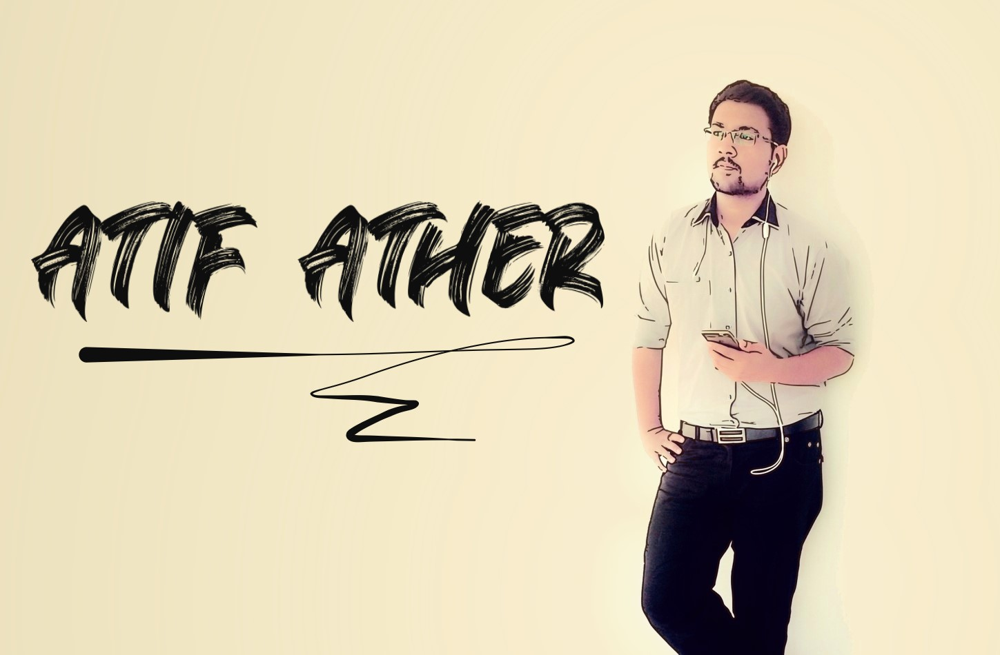

<!--  -->
<!--  -->
<!--  -->

<!--  -->
<!--  -->

<h1 align="center">Hi , I'm Atif Ather</h1>
<h3 align="center">I'm a passionate DevOps from Pakistan.</h3>

## 🙋‍♂️ About Me
<!-- 
Icons made by <a href="https://www.freepik.com" title="Freepik">Freepik</a> from <a href="https://www.flaticon.com/" title="Flaticon">www.flaticon.com</a>
 -->
<!-- - 🔭 I’m currently working on **** -->

- 🌱 I’m currently learning **AWS Solution Architect Associate.**
- 👯 I’m looking to collaborate on **OpenSource Projects.**
- 📫 How to reach me **atifather1@gmail.com**
- ⚡ Fun fact **I play video games and go to the GYM very often.**

## 🚀 Languages and Tools:

 
     
     
     
    
       
     

<!--       -->
## 📞 Connect with me:

  
  

